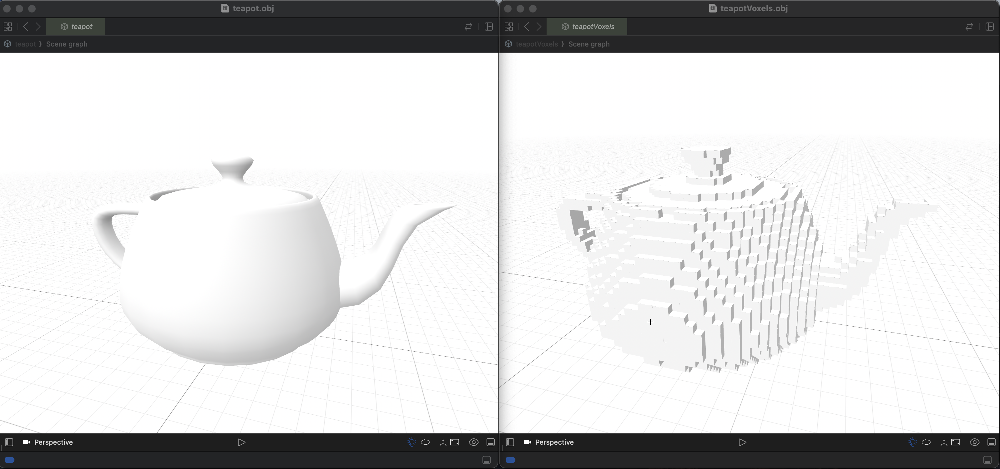

## CS 581: Computational Fabrication

### Course Description
Introduces 3D printing technology and computational methods for creating physical prototypes from geometric models. Student-led paper presentations cover research from prominent Computer Graphics and Human Computer Interaction conferences. Culminates in a design project involving a computational component and physical prototyping.  

### Skillset Developed:
💻  C++, MATLAB  
🖨️  FDM, SLA, DLP, SLS, DMLS, BMD    

## Notable Assignments:
### Linkages Assingment:
This assingment was understanding [linkages](https://en.wikipedia.org/wiki/Linkage_(mechanical)) and their ability to create functional moving animations.

Linkage 1

 

Linkage 2

 

Linkage 3

 

### Voxels:
This assignment was focused on the understanding of [voxels](https://en.wikipedia.org/wiki/Voxel) and creating the ability to create sizes of 32x32x32 and 64x64x64.

Bunny

 

Teapot

