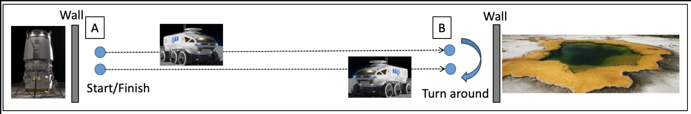
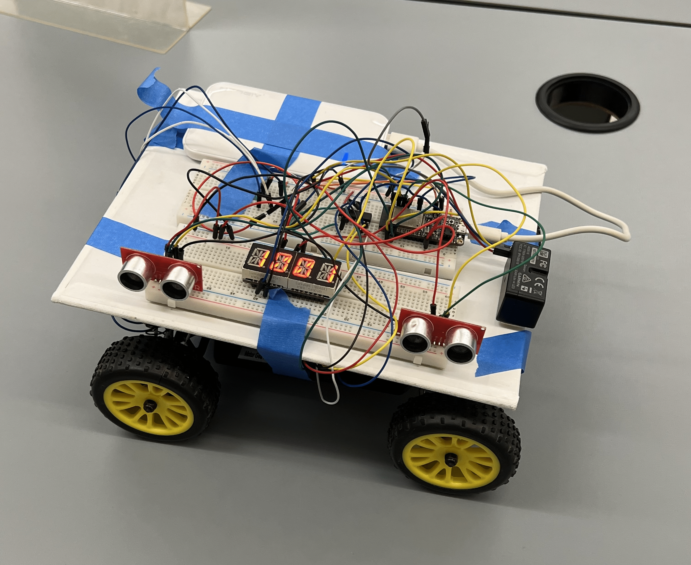

# Quest 4: Venus Rover

Author(s): Nick Ramondo, Dylan Ramdhan, Mete Gumusayak, Houjie Xiong

Date: 2024-11-10

### Summary
In this quest, we were tasked to design a Venus Rover that can drive manually/automatically within certain boundaries. Applying applications of sensoring the boundaries allows the vehicle the ability to detect its surrounding areas to avoid collisions. The route that the rover has to take is to follow a straight line to an endpoint, and then return back to its initial position. In this report, we will further outline the performances of these functionalities on the rover. The Venus Rover, we utilize the usage of PID to allow for speed control, which can be set to a fixed setpoint that can be initiated after startup and before slowdown. As the rover is in motion, we had also initiated that the vehicle immediately stops 20 cm before collision. This would also measure the wheels speed, while also displaying on Alpha Display elasped time. As the vehicle reaches its desination, the vehicle then backs up to return back to its initial position without colliding with any obstacles in its path.
   
In the general scheme of the rover, its purpose serves to provide evidence of human exploration into space and the ability to maneuver in undiscovered territory. Through this specific quest, we are able to truly simulate what its like to build, maintain, and maneuver a Venus Rover.
   

Route of the Venus Rover

### Self-Assessment 

| Objective Criterion | Rating | Max Value  | 
|---------------------------------------------|:-----------:|:---------:|
| Uses PID for Speed Control Holding a Fixed Speed Setpoint After Startup and Before Slowdown | 1 |  1     | 
| Stops within 20 cm of End Without Collision | 1 |  1     | 
| Start and Stop Instructions issued Wirelessly from Phone, Laptop or ESP32 | 1 |  1     | 
| Measures Wheel Speed | 1 |  1     | 
| Uses Alpha Display to Show Elapsed Time Uses Alpha Display to Show Elapsed Time | 1 |  1    | 
| Successfully Traverses B-A in One Go, No Hits or Nudges | 1 |  1     | 
| No Collisions with Obstructions | 1 |  1     | 

### Solution Design
The rover consists the ESP32, Wheel Sensor, Detecting Sensors, LIDAR, and a Node server to operate remotely. The combination of all these components is what steers the rover when placed next to a barrier.

- ESP32  
-- The ESP32 is considered to be the main part of our design as its the controller of the many functions of the vehicle.

- H-BRIDGE   
-- The H-Bridge is utilized to amplify the power source (ESP32) and to power the vehicle.

- ULTRASONIC SENSORS  
-- The Ultrasonic Sensors are utilized to assist the vehicle in steering away from obstacles.

- LIDAR  
-- The LIDAR function asissts the vehicle to move forwards and to detect when to stop to avoid collisions.

- SERVO, ALPHA DISPLAY, & ESC  
-- SERVO: The Servo asissts in the stirring of the wheel.  
-- ALPHA DISPLAY: The Alphanumeric Display would display the elapsed time.  
-- ESC: The Electronic Speed Control (ESC) is the speed of the wheels.

### Sketches/Diagrams

Schematic of the Venus Rover 

 
 

Components of Venus Rover in Progress

 
 

Venus Rover

### Supporting Artifacts
- [Link to Video Technical Presentation](https://youtu.be/n9P5YHc7nYs). Not to exceed 120s
- [Link to Video Demo](https://youtu.be/FABAdD1kChg). Not to exceed 120s

### Modules, Tools, Source Used Including Attribution
[Skill 13: Alphanumeric Display](https://github.com/BU-EC444/01-EBook/blob/main/docs/skills/docs/alpha-display.md) 
[Skill 28: Garmin LIDAR v4](https://github.com/BU-EC444/01-EBook/blob/main/docs/skills/docs/lidar-garmin.md)  
[Skill 29: PID](https://github.com/BU-EC444/01-EBook/blob/main/docs/skills/docs/pid.md)  
[Skill 30: Ultrasonic Sensor 2](https://github.com/BU-EC444/01-EBook/blob/main/docs/skills/docs/ultrasonic2.md)
