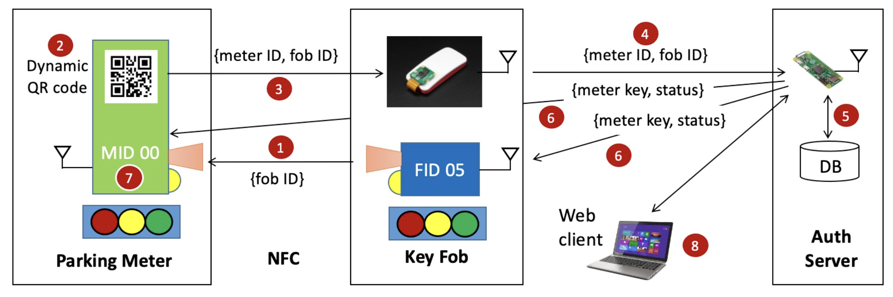
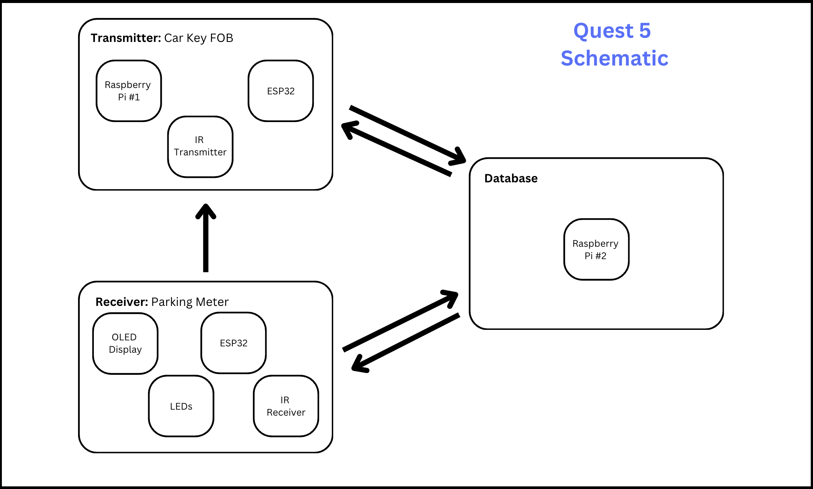
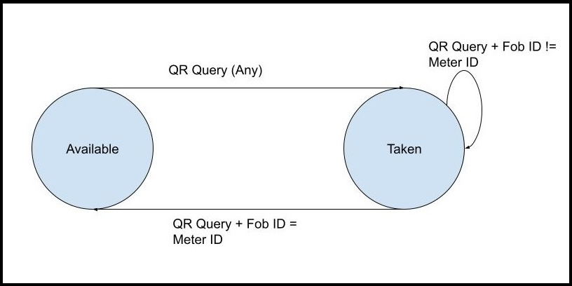
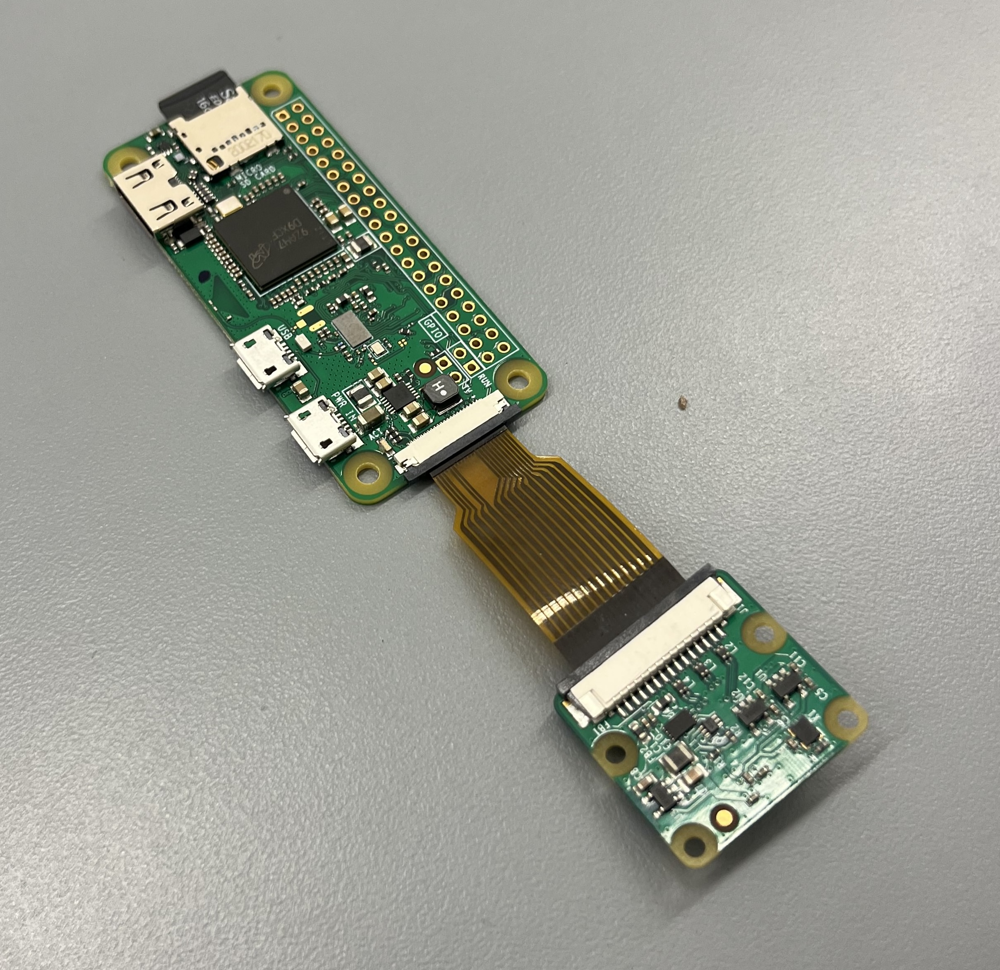
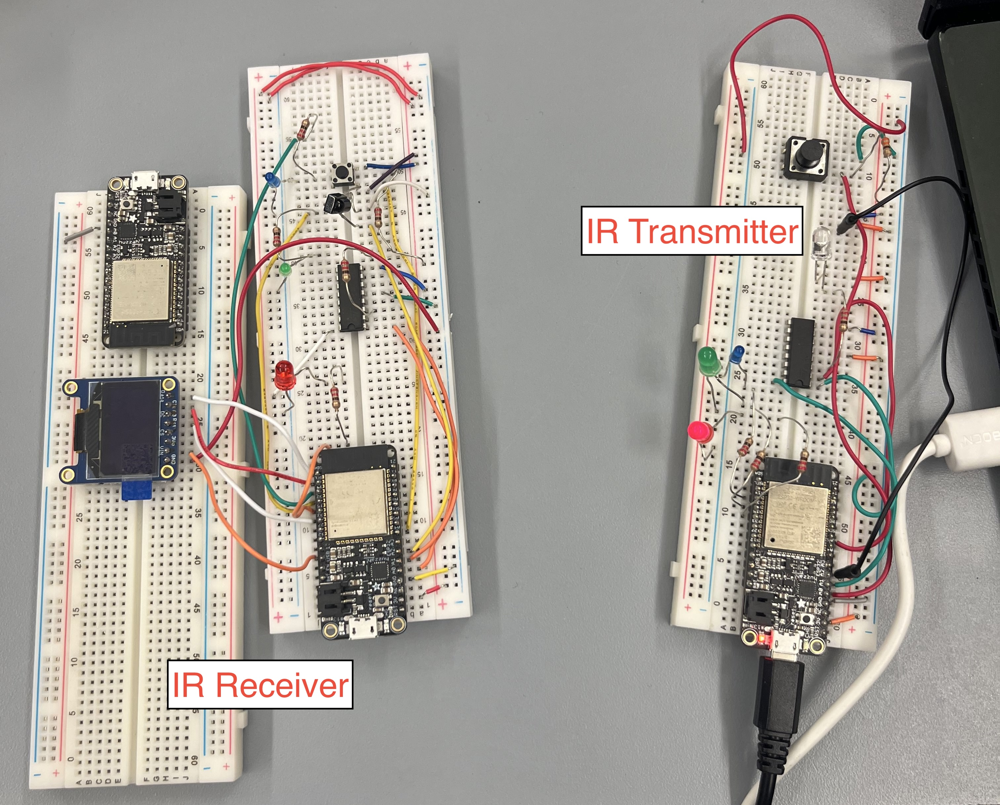

# Quest 5: Secure Parking

Author(s): Nick Ramondo, Dylan Ramdhan, Mete Gumusayak, Houjie Xiong

Date: 2023-12-01

<p align="center">

</p>
<p align="center">
</p>

### Summary

In this quest, we were asked to simulate a smart secure parking system similar to what one may find in cities. The system will include a client key fob, a parking meter, and a database. The key fob will read a QR code generated by the meter and upload the resulting meter and key fob ID to the database, which will keep track of which fobs are parked in which selected spots. The database will verify that the spot is available and allows the user to park in the spot if it is open. If it is not available, the spot will state that the spot is not to be open until the owner of the spot sends another query to release the spot back to its available state. To accomplish this, we take advantage of the Rasberry Pi with a PiCamera as our key fob/QR Code reader and an ESP with an OLED display to act as our meter, with both having access to and in communication with our database via WiFi.

<br>

### Self-Assessment 

| Objective Criterion | Rating | Max Value  | 
|---------------------------------------------|:-----------:|:---------:|
| Fob Sends (IR TX/RX) FID to Meter | 1 |  1     | 
| Meter ESP Displays QR Code with MID, FID | 1 |  1     | 
| Fob Pi reads QR code on Meter and Sends (WiFi) to Auth Server with MID, ID | 1 |  1     | 
| DB Logs MID,FID, Timestamp and Validates Meter Available; Sends (WiFi) MID, Status to Fob and Meter | 1 |  1     | 
| Meter Evaluates Status and Sets LEDs to indicate Booking | 1 |  1     | 
| Web Client Accesses Auth Server to Show Logged Data and Meter Status | 1 |  1     | 
| Auth Server implemented in TingoDB and on Separate Pi | 1 |  1     |
| Investigative Question Response | 1 |  1     | 

<br>

### Solution Design

The project uses a variety of methods to get our major pieces to communicate with each other and advance through the states of the parking spot. The meter and Fob are in communication via IR RX/TX. The fob acts as the transmitter and will emit the IR signal to the meter's IR receiver. This signal will relay the fob's ID to the meter. The Fob is made up of an ESP and a Raspberry Pi. The ESP will send the IR signals for the meter while the Raspberry Pi is in communication with the database.

The meter will generate a unique QR code with the fob and meter ID. This is scanned by the PiCam and uploaded to the database for verification via WiFi. The Raspberry Pi is constantly looking at the most current photo to see wether it is a QR code. When a QR code is found it will send the data contained in the QR code to the database as a Query to be analyzed.

The database is split into a log of all queries uploaded to the server as well as a running list of occupied parking spots in its network with their corresponding Fob IDs and parking time (In an ideal world we would have multiple fobs and meters to create a network of parking spots for our system). Upon receiving a query a new entry is always created in the log. The database will first check to see if the meter corresponding to the meter ID uploaded is occupied on the running list. If it is not occupied then the meter will enter the Occupied state. If the meter is on the running list (I.E. it is occupied), The database will have to check the Fob and Meter ID of the Query against the running list. If a key that does not occupy the meter is attempting to Query, the meter is not released out of the Occupied state. Only a new query from the correct fob ID in the Occupied state can set the meter back to the Available state. The database will return the state of the meter so it can be displayed to users. The database can also be accessed from a web browser which can be used to show the current state of all parking spots at any time.

<p align="center">

</p>
<p align="center">
Key Fob System Architecture & Data Flow
</p>

<br>
<br>

### Sketches/Diagrams
<p align="center">

</p>
<p align="center">
Parking System Hardware Overview
</p>

<br>
<br>

<p align="center">

</p>
<p align="center">
State Machine Diagram:<br> How the Meter Cycles Through Avaliable & Taken States
</p>

<br>
<br>

<p align="center">

</p>
<p align="center">
Raspberry Pi with PiCam
</p>

<br>
<br>

<p align="center">

</p>
<p align="center">
IR Receiver & IR Transmitter Build
</p>

<br>

### Investigative Question & Response
Investigative Question: How can our secure parking be hacked? 

There are a number of vulnerabilities in this method that a user can take advantage of to misuse the system in place. One possible way would be to have a clone key fob with an identical IR signal. An identical IR signal would allow a user to act as the owner of the original fob and open up their parking space or falsely charge the original owner for parking. A potential fix for this issue would be to add another step to the verification process. A keypad could be inserted into the meter and it would be simple to ask for a 4 digit password from the user and have it verified by a database that holds the Fob IDs and Pin numbers together.

Another weakness in our system would be the Queries to the database. These queries are unencrypted and theoretically somebody could enter the network and send a query identical to the ones the meter sends to input garbage data into the system. An easy way of rectifying this would be to encrypt the data being sent and received. This way it will be impossible to figure out how to send signals identical to the ones sent by the meters in our system. 

### Supporting Artifacts
- [Link to video technical presentation](https://youtu.be/fP-OZm2Cm2I). Not to exceed 120s
- [Link to video demo](https://youtu.be/JUG5bv85Qjs). Not to exceed 120s

<br>

### AI Use

We used {chat.openai.com GPT-3.5} on {12/1/2023} with the following prompt:

***Prompt***

```
Make a Javascript function to generate HTML table from 2D JavaScript Array, and has the column names MeterID, Status, Time, FobID, and which it can store in an Array and remove all previous tables


```

***Code Attribution***

We have included a comment in my code index.html for this assignment stating the following:

This code block was generated by Mete using {chat.openai.com
GPT-3.5} on {12/1/2023}

### Modules, Tools, Source Used Including Attribution
We modified the following example code to help us in our quest:

[IR TX/RX Example](https://github.com/BU-EC444/04-Code-Examples/tree/main/ir-txrx-example) <br>
[OLED Display Example](https://github.com/BU-EC444/04-Code-Examples/tree/main/oled-qr-display)<br>
[QR Code Bitmap Converter](https://mischianti.org/images-to-byte-array-online-converter-cpp-arduino/) <br>
[Database Example](https://github.com/BU-EC444/01-EBook/blob/main/docs/recipes/docs/tingo.md)
