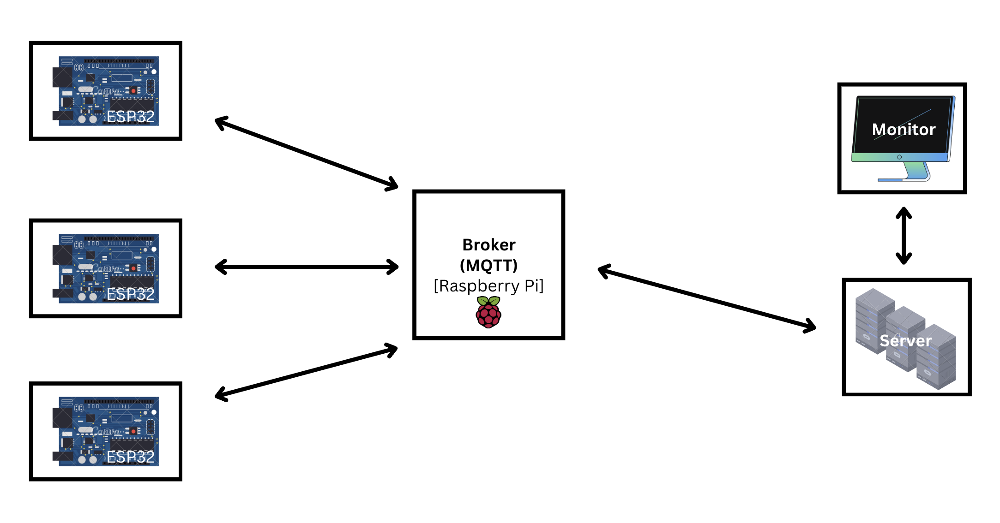
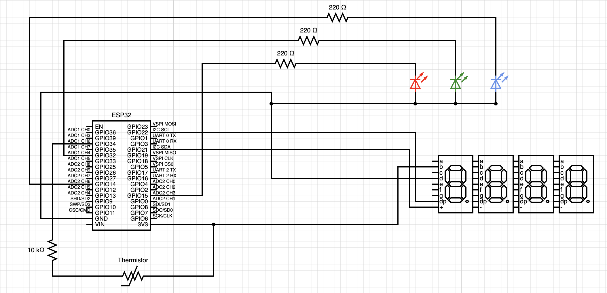
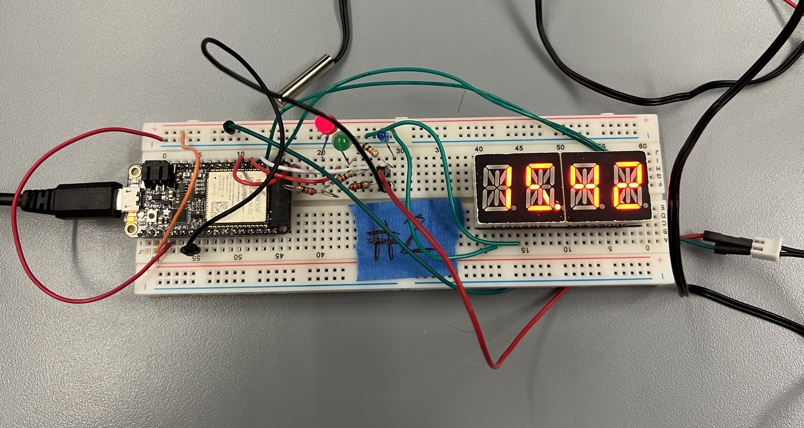

# Quest 6: iMonitor

Author(s): Nick Ramondo, Dylan Ramdhan, Mete Gumusayak, Houjie Xiong

Date: 2023-12-12

### Summary

In this quest, we were taksed with creating a monitoring system that can monitor temperature conditions of a given labatory environment. The idea is to model a smart Air Conditioning system with the ability to be set remotely. Temperature will be read and displayed by each AC Unit (ESP32). The values are passed through an MQTT message broker to a server run on a Raspberry Pi which monitors and controls all AC Units on the network. With access to the server, a user has the ability to *set* the temperature of any AC Unit to their liking. The message broker is able to pass the message back to the targeted AC Unit and will result in the AC Unit acting accordingly to the message that was sent.
 

### Self-Assessment 

Objective Criteria (0/1, 1=met)                                                           | Rating | Max | 
| ----------------------------------------------------------------------------------------- | ------ | --- | 
| Using at Least 3 ESP32s running MQTT Protocol    | 1  | 1 | 
| Using MQTT Message Broker on Pi    |  1 | 1 | 
| Multiple Clients can Subscribe to Message Broker    |  1 | 1 | 
| Client Displays Tabluated Values from each ESP32     |  1 | 1 | 
| Client Displays Live Visualization of Device Values as Graphic (Map, Chart, etc.)    |  1 | 1 | 
| Client runs on External Network    |  1 | 1 | 
| Client is able to Change Status of LED on each ESP32     | 1  | 1 | 
 

### Solution Design
Our design consists of multiple ESP32 systems acting as our AC Units and a Raspberry Pi running a web server to act as our controller. Messages are passed back and forth from one end of our system to the other using MQTT like in the diagram below.

Block Diagram of iMonitor

The MQTT Broker does majority of wireless data transfer. There are two main channels, **set** and **temp**, which both the server and the ESP32s are subscribed to. The ESP32 publishes their temperatures to the **temp** channel which is read, processed, and displayed by the server. The server publishes to the **set** server specifically formatted messages upon request which is read by every ESP32 on the network. These messages are formatted "AC_ID REQ_TEMP". The AC Unit ID allows the the requested unit to act upon request. When a message is activated to a specific AC Unit, it is received and will allow the AC Unit to respond accordingly, by raising and lowering the specfied temperature allowing the room to be either heated or cooled.

 
 

### Sketches/Diagrams

Schematic of iMonitor

 
 

Circuit Overview of iMonitor

 

Website for Temperature Tracking & Setting 

 
 

### Supporting Artifacts
- [Link to video technical presentation](https://youtu.be/8FqM-eC9ELI). Not to exceed 120s
- [Link to video demo](https://youtu.be/Jo-TxWS_lMg). Not to exceed 120s

 

### Modules, Tools, Source Used Including Attribution
We modified the following example code to assist us in this Quest:  
[Link to: Alphanumeric Display I2C](https://github.com/BU-EC444/01-EBook/blob/main/docs/skills/docs/alpha-display.md)  
[Link to: MQTT5 Example](https://github.com/espressif/esp-idf/tree/03414a15508036c8fc0f51642aed7a264e9527df/examples/protocols/mqtt5) 
[Link to: Termistor Example](https://github.com/espressif/esp-idf/tree/39f090a4f1dee4e325f8109d880bf3627034d839/examples/peripherals/adc) 
[Link to: Mosquitto Pi](https://randomnerdtutorials.com/how-to-install-mosquitto-broker-on-raspberry-pi/)
