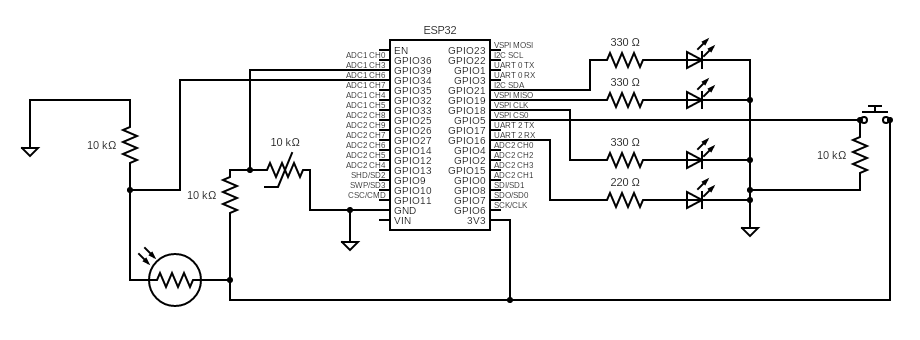
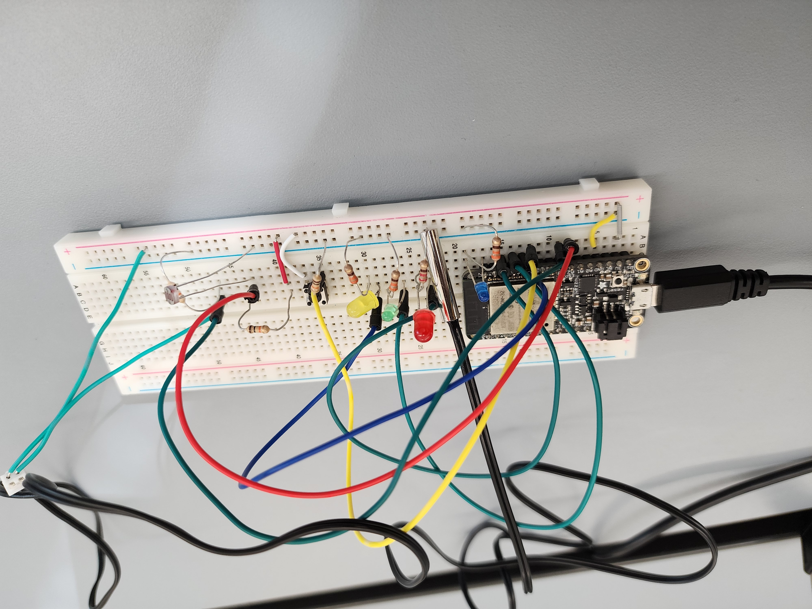

# Quest 1: Mission Impossible Vault

Authors: Nick Ramondo, Mete Gumusayak, Dylan Ramdhan, Houjie Xiong

Date: 2023-09-22

### Summary

  The objective of this quest was to create a model of the vault featured in the Mission Impossible movie franchise. The vault in the movie is equipped with equipment that detects changes in temperature and light in the room as well as any changes to the pressure on the floor. We created a circuit that will measure the temperature and light in a given room as well as a button (to act as our floor). If any of these sensors are triggered the alarm for the respective sensor of the 'vault' will activate, otherwise the all-good indicator is on.

### Self-Assessment 

| Objective Criterion | Rating | Max Value  | 
|---------------------------------------------|:-----------:|:---------:|
| Objective One |  1|  1     | 
| Objective Two |  1|  1     | 
| Objective Three | 1 |  1     | 
| Objective Four | 1 |  1     | 
| Objective Five | 1 |  1     | 
| Objective Six | 1 |  1     | 
| Objective Seven | 1 |  1     | 

### Solution Design
  Our solution features the Espressif ESP32, a photocell, a push button, a thermistor and a push button. 3 LEDs are to indicate the alarms and 1 is for the all-good signal. The push button causes a hardware interrupt on the positive and negative edges which says if the button is pressed down and activates the alarm. The all-good range of the photocell is 0.8V to 1V and for the thermistor it is 20°C to 23.5°C.

### Sketches/Diagrams

Circuit Diagram

  Our project

### Supporting Artifacts
- [Link to video technical presentation](https://youtu.be/-vPlpx3D7Y8). Not to exceed 120s
- [Link to video demo](https://youtu.be/6oTGMa7bSm0). Not to exceed 120s

### Modules, Tools, Source Used Including Attribution
- [Link to the formula used for converting voltage to degree](https://www.allaboutcircuits.com/industry-articles/how-to-obtain-the-temperature-value-from-a-thermistor-measurement/).
- [Link to hardware interrupt example code used](https://github.com/BU-EC444/01-EBook/blob/main/docs/briefs/design-patterns/dp-interrupts.md).