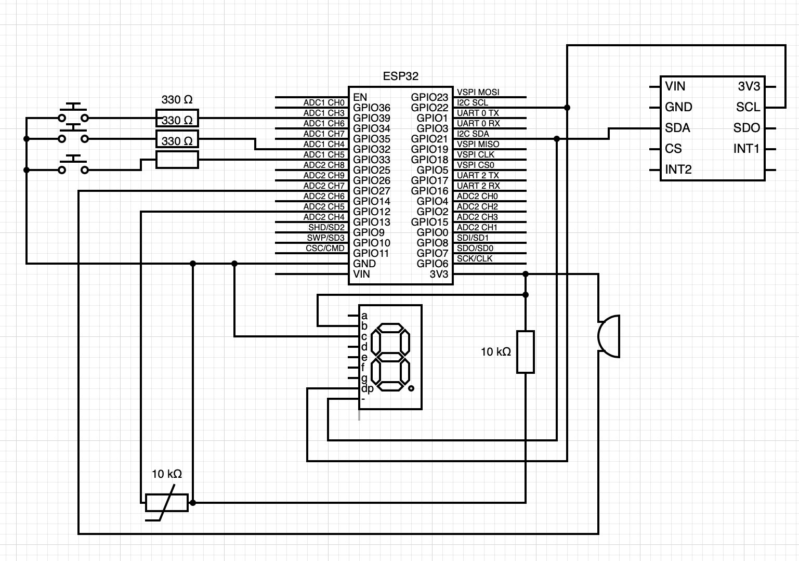
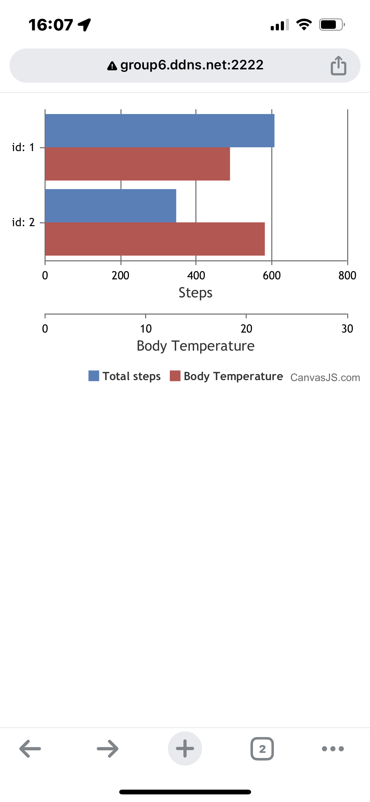

# Quest 3: Straba Social Media Hub

Authors: Nick Ramondo, Dylan Ramdhan, Mete Gumusayak, Houjie Xiong

Date: 2023-10-26

### Summary

In Quest #3, our group successfully built a device that functions similarly to common smart watches available today, including the ability to measure body temperature, act as a pedometer, display time and include stopwatch functionality. This report will outline an expansion of the functionalities of this device, allowing the watch to connect to a wireless network and feed data about the user into a server. The server will be able to handle data fed in and process for all smart watch devices connected, displaying a leaderboard of steps taken on a web server and on the alphanumeric display of the watch with the most steps. When all of these goals are accomplished, we will have successfully built a wireless network environment of multiple smart watches feeding information into a single server, then relaying back to the smart watches when appropriate. 

### Self-Assessment 

| Objective Criterion | Rating | Max Value  | 
|---------------------------------------------|:-----------:|:---------:|
| Carmins connected via WiFi | 1 |  1     | 
| Data from each Carmin sent to central server and aggregated | 1 |  1     | 
| Portal reports live leader status and charts on web site | 1 |  1     | 
| Central server reports live leader status back to Carmin alpha displays | 1 |  1     | 
| Portal accessible from open internet | 1 |  1     | 
| Web cam operational in same browser window at client (This part was optional) | 0 |  1     | 
| Node.js runs on pi |1  |  1     | 

### Solution Design

Our solution design will use the same hardware from the last quest along with a lot of the same code for the ESP-32 for all of the same functions as the last quest. As before, we will use the ESP32, an Accelerometer, a Thermistor, Push Buttons, a Buzzer, and an Alphanumeric Display. The Circuit diagram for the SmartWatch can be found below.

The ESP32 uses communication methods such as I2C bus to receive signals from the sensors attached to it and will process these signals into real-world data such as 'temperature' and 'steps taken' in software. More detailed information on the original design of the Smart Watch portion of our network can be found [here](https://github.com/BU-EC444/Team6-Xiong-Ramdhan-Gumusayak-Ramondo/tree/main/quest-2)

In addition to the materials used in the last Quest, we needed to use a Raspberry Pi and an Internet Router to set up wireless communication. The Router is WPA2 protected. Devices connected to the Wi-Fi network from our router will be able to wirelessly send data back and forth using the Router as a 'middleman' of sorts and assisted in software via Sockt.js, software allowing for back-and-forth event-based communication between a host(server) and client(Smart Watches). The Raspberry Pi has the Node.js software installed, allowing the Pi to act as a host receiving data from all ESPs on the network. 

The original code of the Smart Watch device was altered to include Wi-Fi functionality. We were provided an example code used to connect a general ESP32 to a wifi network, which can be found [here](https://github.com/espressif/esp-idf/tree/master/examples/wifi/getting_started/station). This code, largely unchanged from the example, was set to run during the setup phase of the ESP32. We modified the sdkconfig file to always look for our Wi-Fi network upon setup, so barring network connectivity issues each ESP32 will always immediately connect to our network.

The Node file on the Raspberry Pi receives the data from each ESP and will process it in a few different ways. The server will write a new text file with the data received every time new data becomes available to the Pi's memory. The data will also be processed in a website, where anyone with access to our wireless network can go to our site to see a graphical representation of the data made using the Canvas.js software. This graph is also constantly updated whenever new data is received. Lastly, The host is able to communicate back to the client whenever a particular client is in the lead on steps taken. When a particular smart watch has taken more steps than the others, the server tells the ESP32, and then the alphanumeric display of that ESP32 will inform the user. In order to have Portal accessible from the open internet we used a DDNS from ddns.net with port forwarding to our host server which was running on the Raspberry Pi

It should be noted that in the original assignment, we were also asked to incorporate a web camera with the Raspberry Pi and to include a live video feed from the camera on our website. This part of the assignment was removed after technical difficulties and therefore it will not be included in our design.

### Sketches/Diagrams

Circuit Diagram- Note that the hardware on the watch is the same as Quest 2

 
 

Example of Graphical Representation via Canvas.js
   on a different Wi-Fi Server, 'BU (802.1x)'

 
 

### Supporting Artifacts
- [Link to video technical presentation](https://youtu.be/2jGft0ga1S4). Not to exceed 120s
- [Link to video demo](https://youtu.be/JEeT8LRACQQ). Not to exceed 120s

### Sample Code Use

We have used the following sample code in the development of this project:

[Quest 2: Carmin Smart Watch](https://github.com/BU-EC444/Team6-Xiong-Ramdhan-Gumusayak-Ramondo/tree/main/quest-2)

[Station ESP32 Example](https://github.com/espressif/esp-idf/tree/master/examples/wifi/getting_started/station)

[Example Bar chart](https://canvasjs.com/javascript-charts/multi-series-bar-chart/)

[Socket example](https://github.com/BU-EC444/01-EBook/blob/main/docs/briefs/design-patterns/dp-socketIO.md)

